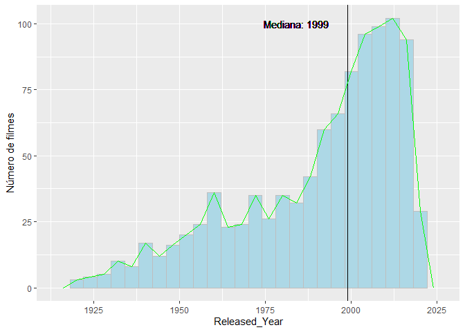
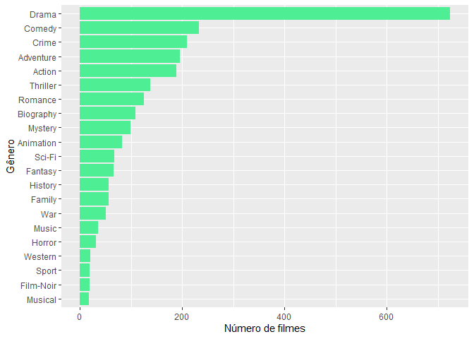

Análise dos 1000 filmes mais bem avaliados
================

------------------------------------------------------------------------

# 1 - Tratando os dados

------------------------------------------------------------------------

## 1.1 - Importando

``` r
library(tidyverse)
library(forcats)
library(stringr)

df <- read_csv("imdb_top_1000.csv", show_col_types = FALSE)
```

------------------------------------------------------------------------

## 1.2 - Compreendendo

``` r
glimpse(df)
```

    ## Rows: 1,000
    ## Columns: 16
    ## $ Poster_Link   <chr> "https://m.media-amazon.com/images/M/MV5BMDFkYTc0MGEtZmN~
    ## $ Series_Title  <chr> "The Shawshank Redemption", "The Godfather", "The Dark K~
    ## $ Released_Year <chr> "1994", "1972", "2008", "1974", "1957", "2003", "1994", ~
    ## $ Certificate   <chr> "A", "A", "UA", "A", "U", "U", "A", "A", "UA", "A", "U",~
    ## $ Runtime       <chr> "142 min", "175 min", "152 min", "202 min", "96 min", "2~
    ## $ Genre         <chr> "Drama", "Crime, Drama", "Action, Crime, Drama", "Crime,~
    ## $ IMDB_Rating   <dbl> 9.3, 9.2, 9.0, 9.0, 9.0, 8.9, 8.9, 8.9, 8.8, 8.8, 8.8, 8~
    ## $ Overview      <chr> "Two imprisoned men bond over a number of years, finding~
    ## $ Meta_score    <dbl> 80, 100, 84, 90, 96, 94, 94, 94, 74, 66, 92, 82, 90, 87,~
    ## $ Director      <chr> "Frank Darabont", "Francis Ford Coppola", "Christopher N~
    ## $ Star1         <chr> "Tim Robbins", "Marlon Brando", "Christian Bale", "Al Pa~
    ## $ Star2         <chr> "Morgan Freeman", "Al Pacino", "Heath Ledger", "Robert D~
    ## $ Star3         <chr> "Bob Gunton", "James Caan", "Aaron Eckhart", "Robert Duv~
    ## $ Star4         <chr> "William Sadler", "Diane Keaton", "Michael Caine", "Dian~
    ## $ No_of_Votes   <dbl> 2343110, 1620367, 2303232, 1129952, 689845, 1642758, 182~
    ## $ Gross         <dbl> 28341469, 134966411, 534858444, 57300000, 4360000, 37784~

A base de dados contém dados dos 1000 filmes mais bem avaliados segundo
o Imdb.

Utilizando o comando glimpse podemos ter acesso às colunas da base.

-   **Poster\_Link**: Link para o poster do filme
-   **Series\_Title**: Nome do filme
-   **Released\_Year**: Ano que o filme foi lançado
-   **Certificate**: Classificação indicativa
-   **Runtime**: Duração do filme
-   **Genre**: Gêneros do filme
-   **IMDB\_Rating**: Nota de acordo com o site IMDB que leva em conta a
    avaliação popular (Crítica não especializada)
-   **Overview**: Descrição do filme
-   **Meta\_score**: Nota da crítica especializada
-   **Director**: Nome do diretor
-   **Star1-Star4**: Nome de atores principais
-   **No\_of\_Votes**: Número de votos no site IMDB para o filme
-   **Gross**: Faturamento bruto do filme

*Observando a descrição dos campos e os tipos de dados com glimpse vemos
que temos que transformar os dados para facilitar a análise*

1.  **Transformar a coluna Released\_Year de caractere para numérico.**
2.  **Transformar a coluna Runtime de caractere para numérico.**
3.  **Transformar Certificate em um fator com um número de níveis
    menores.**
4.  **Tratar a coluna Genre, pois é um caractere com vários gêneros
    separados por ,.**

------------------------------------------------------------------------

## 1.3 - Transformando

------------------------------------------------------------------------

### 1.3.1 - Released\_Year \| Caractere –&gt; Numérico

``` r
df <- df %>% mutate(Released_Year = parse_number(Released_Year))
```

    ## Warning: 1 parsing failure.
    ## row col expected actual
    ## 967  -- a number     PG

Parse\_number encontrou um erro na linha 967, pois encontrou os
caracteres “PG” que não dá para converter para número. Vamos olhar a
linha 967.

``` r
df[967,]
```

    ## # A tibble: 1 x 16
    ##   Poster_Link   Series_Title Released_Year Certificate Runtime Genre IMDB_Rating
    ##   <chr>         <chr>                <dbl> <chr>       <chr>   <chr>       <dbl>
    ## 1 https://m.me~ Apollo 13               NA U           140 min Adve~         7.6
    ## # ... with 9 more variables: Overview <chr>, Meta_score <dbl>, Director <chr>,
    ## #   Star1 <chr>, Star2 <chr>, Star3 <chr>, Star4 <chr>, No_of_Votes <dbl>,
    ## #   Gross <dbl>

O filme da linha 967 é “Apollo 13”, podemos descobrir o ano de
lançamento dele no google e consertar esse erro.

``` r
df <- df %>% mutate(Released_Year = ifelse(Series_Title=="Apollo 13", 1995, Released_Year))
```

Substituindo o dado faltante pelo ano de lançamento de “Apollo 13”
(1995), esta parte está concluída.

------------------------------------------------------------------------

### 1.3.2 - Runtime \| Caractere –&gt; Numérico

``` r
df <- df %>% mutate(Runtime = parse_number(Runtime))
```

------------------------------------------------------------------------

### 1.3.3 - Certificate \| Organizando os níveis

``` r
levels(factor(df$Certificate))
```

    ##  [1] "16"       "A"        "Approved" "G"        "GP"       "Passed"  
    ##  [7] "PG"       "PG-13"    "R"        "TV-14"    "TV-MA"    "TV-PG"   
    ## [13] "U"        "U/A"      "UA"       "Unrated"

Observando os possíveis certificados e fazendo uma pesquisa.

-   <https://en.wikipedia.org/wiki/Motion_picture_content_rating_system>
-   <https://en.wikipedia.org/wiki/Television_content_rating_system>
-   <https://en.wikipedia.org/wiki/Motion_Picture_Association_film_rating_system#From_M_to_GP_to_PG>
-   <https://en.wikipedia.org/wiki/Central_Board_of_Film_Certification>

| Desconhecido | Brasil |
|--------------|--------|
| 16           | 16+    |

| EUA    | Brasil |
|--------|--------|
| G      | L      |
| PG, GP | 10+    |
| PG-13  | 13+    |
| R      | 18+    |

| EUA TV | Brasil |
|--------|--------|
| TV-PG  | 10+    |
| TV-14  | 14+    |
| TV-MA  | 18+    |

| India   | Brasil |
|---------|--------|
| U       | L      |
| UA, U/A | 12+    |
| A       | 18+    |

| Inglaterra 1912-1932 | Brasil |
|----------------------|--------|
| Passed               | L      |
| Approved             | 16+    |

Agrupando eles em três grupos:

-   L, 12+, 16+

``` r
df <- df %>% mutate(Certificate=factor(Certificate))

df <- df %>% mutate(Certificate=fct_collapse(Certificate,
                                           "L"=c("G","PG","GP",
                                              "TV-PG","U","Passed"),"12+"=c("PG-13", "TV-14","UA","U/A"),
  "16+"=c("A","Approved","TV-MA","R","16"),NULL=c("Unrated")))

df <- df %>% mutate(Certificate=factor(Certificate,levels=c("L","12+","16+")))
```

------------------------------------------------------------------------

### 1.3.4 - Genre \| Separando

Um filme pode ter mais de um gênero, por isso a coluna Genre pode ter
até três gêneros por célula, separados por vírgula. Para filmes com mais
de um gênero, vamos separar os gêneros em linhas. Por exemplo, se um
filme é de Ação, Aventura e Sci-Fi, terá três linhas, um para cada
gênero.

Vamos criar um data frame novo para isso, pois isso irá aumentar o
número de linhas, logo dependendo de quais variáveis quisermos analisar,
será melhor usar o data frame original.

``` r
df_genero <- df %>% separate_rows(Genre, sep=",") %>%
  mutate(Genre=str_trim(Genre))
```

Por enquanto essas transformações serão suficientes, mais à frente
faremos mais a fim de analisar também os atores.

------------------------------------------------------------------------

# 2 - Analisando os dados

Vamos começar analisando a variação dentro das variáveis e depois
investigaremos a covariação entre as variáveis.

------------------------------------------------------------------------

## 2.1 - Variação

A fim de sermos suscintos não vamos analisar todas as variáveis
possíveis. Filtrando as mais importantes, analisaremos nesta ordem:

-   **IMDB\_Rating**
-   **Released\_Year**
-   **Genre**

Usaremos o data frame original (df) para todas as variáveis exceto Genre
(usaremos df\_genero).

### 2.1.1 - IMDB\_Rating

Como é uma variável contínua usaremos um histograma

``` r
df %>% ggplot(aes(x=IMDB_Rating))+
  geom_histogram(binwidth=0.1)+
  labs(y="Número de Filmes")+
  geom_vline(xintercept = median(df$IMDB_Rating))+
  geom_text(aes(x=median(df$IMDB_Rating), y=160,
                label=str_c("Mediana: ",median(df$IMDB_Rating))),
            nudge_x=0.2)
```

<!-- -->

A partir do rating 8.0 cada vez menos filmes se apresentam, indicando
que obter uma nota acima de 8.0 é bastante difícil. Vamos analisar o
gráfico de boxplot agora.

``` r
df %>% ggplot(aes(x="", y=IMDB_Rating))+
  geom_boxplot()+
  labs(x="")
```

<!-- -->

Filmes acima de 8.7 são classificados como outliers, pois são raros.
Vamos ver quais filmes são esses.

``` r
df %>% filter(IMDB_Rating>=8.7) %>%
  select(Series_Title, IMDB_Rating) %>%
    arrange(desc(IMDB_Rating))
```

    ## # A tibble: 18 x 2
    ##    Series_Title                                      IMDB_Rating
    ##    <chr>                                                   <dbl>
    ##  1 The Shawshank Redemption                                  9.3
    ##  2 The Godfather                                             9.2
    ##  3 The Dark Knight                                           9  
    ##  4 The Godfather: Part II                                    9  
    ##  5 12 Angry Men                                              9  
    ##  6 The Lord of the Rings: The Return of the King             8.9
    ##  7 Pulp Fiction                                              8.9
    ##  8 Schindler's List                                          8.9
    ##  9 Inception                                                 8.8
    ## 10 Fight Club                                                8.8
    ## 11 The Lord of the Rings: The Fellowship of the Ring         8.8
    ## 12 Forrest Gump                                              8.8
    ## 13 Il buono, il brutto, il cattivo                           8.8
    ## 14 The Lord of the Rings: The Two Towers                     8.7
    ## 15 The Matrix                                                8.7
    ## 16 Goodfellas                                                8.7
    ## 17 Star Wars: Episode V - The Empire Strikes Back            8.7
    ## 18 One Flew Over the Cuckoo's Nest                           8.7

Podemos ver os dezoito filmes com notas atipicamente altas.

### 2.1.2 - Released\_Year

Faremos também um histograma para essa variável.

``` r
df %>% ggplot(aes(x=Released_Year))+
  geom_histogram(binwidth = 4, fill="light blue", colour="grey")+
  geom_vline(xintercept = median(df$Released_Year))+
  geom_text(aes(x=median(df$Released_Year), y=100, 
                label=str_c("Mediana: ",median(df$Released_Year))),
            nudge_x = -15)+
  geom_freqpoly(binwidth=4, colour="green")+
  labs(y="Número de filmes")
```

<!-- -->

-   **Análise:** Observando o histograma e a mediana, concluímos que
    dentre os 1000 filmes mais bem avaliados, há uma maior densidade de
    filmes mais novos (Lançados depois de 1999). Ou seja, há uma grande
    quantidade de filmes novos bem avaliados proporcionalmente ao
    intervalo de lançamento (de aproximadamente 20 anos).

-   **Explicação:** Isso se deve provavelmente ao fato de que a
    indústria cinematográfica cresce a cada ano, logo a quantidade de
    filmes lançados aumenta todo ano. Com o aumento da oferta, a
    quantidade absoluta de filmes bons também aumenta. É possível
    perceber isso no histograma, a frequência cresce com o passar dos
    anos.

Vamos posteriormente analisar como o ano de lançamento afeta o
IMDB\_Rating do filme.

### 2.1.3 - Genre

Vamos usar o df\_genero para essa variável, pois um filme pode ter mais
de um gênero. Dividimos os gêneros em observações para facilitar.

``` r
df_genero %>% count(Genre) %>%
  ggplot(aes(x=fct_reorder(Genre, n), y=n))+
  geom_col(fill="seagreen2")+
  coord_flip()+
  labs(x="Gênero", y= "Número de filmes")
```

<!-- -->

-   **Análise**: Podemos observar que dentre os filmes mais bem
    avaliados, o gênero Drama está presente em grande parte deles.

-   **Explicação**: É possível que Drama de fato seja um gênero bem
    popular. Outra explicação possível para ele aparecer em tantos
    filmes bem avaliados é o fato de ele ser um gênero bem amplo, ou
    seja, pode acompanhar vários outros gêneros, como Biografia,
    Romance, Comédia (Comédia Dramática por exemplo). Vamos investigar
    essa hipótese.

Utilizando o data frame original, vamos selecionar os que drama está na
descrição de Gênero.

``` r
df %>% filter(str_detect(Genre, "Drama")) %>%
  separate_rows(Genre, sep=",") %>%
  mutate(Genre=str_trim(Genre)) %>%
  count(Genre) %>% arrange(desc(n)) %>%
  filter(Genre!="Drama") %>%
  ggplot(aes(x=fct_reorder(Genre, n), y=n))+
  geom_col(fill="indianred")+
  coord_flip()+
  labs(x="Gêneros que acompanham Drama", y="Número de filmes")
```

<!-- -->

Como pode ser observado, muitos filmes classificados como Drama, também
são classificados como Romance, Crime, Biografia e Comédia. Esse fato dá
suporte à hipótese de que muitos filmes bem avaliados também têm a
classificação Drama por Drama ser um gênero muito abrangente. Afinal,
drama está presente em quase todo filme, é uma condição para um bom
enredo.

------------------------------------------------------------------------

## 2.2 - Covariação

Agora vamos analisar como uma variável varia em função de outra. Para
facilitar, dividiremos em tipos de variável.

### 2.2.1 - Contínua x Contínua

#### 2.2.1.1 - Meta\_Score x IMDB\_Rating

Lembrando, Meta\_Score é atribuído pela crítica especializada,
estudiosos do assunto. Já IMDB\_Rating é dado por usuários comuns que
podem ser leigos no assunto.

> Pergunta: Filmes bem avaliados pelo público tendem também a ser bem
> avalidos pela crítica?

``` r
df %>% ggplot(aes(x=IMDB_Rating, y=Meta_score))+
  geom_point()+
  geom_smooth(se=FALSE)
```

<!-- -->

Primeiramente, vamos observar que IMDB\_Rating só assume números com uma
casa decimal, por isso as linhas verticais. Vamos adicionar um pouco de
ruído para facilitar a observação.

``` r
df %>% ggplot(aes(x=IMDB_Rating, y=Meta_score))+
  geom_jitter()+
  geom_smooth(se=FALSE)
```

<!-- -->

-   **Análise:** Pelo modelo ajustado com geom\_smooth (a linha azul), é
    possível observar que há um crescimento do Meta\_Score com o
    crescimento do IMDB\_Rating. Porém esse comportamento está longe de
    ser linear. Além disso, quanto menor o IMDB\_Rating, maior a
    variação de Meta\_score, ou seja, menor o consenso entre Críticos e
    Público.

Vamos observar alguns filmes que são bem avaliados pelo público, mas não
pelo Meta\_score.

``` r
df %>% filter(Meta_score < 50) %>% select(Series_Title, Meta_score, IMDB_Rating) %>% arrange(Meta_score)
```

    ## # A tibble: 19 x 3
    ##    Series_Title                   Meta_score IMDB_Rating
    ##    <chr>                               <dbl>       <dbl>
    ##  1 I Am Sam                               28         7.7
    ##  2 The Butterfly Effect                   30         7.6
    ##  3 Tropa de Elite                         33         8  
    ##  4 Seven Pounds                           36         7.6
    ##  5 Kai po che!                            40         7.7
    ##  6 Fear and Loathing in Las Vegas         41         7.6
    ##  7 The Boondock Saints                    44         7.8
    ##  8 Predator                               45         7.8
    ##  9 Flipped                                45         7.7
    ## 10 Jeux d'enfants                         45         7.6
    ## 11 Saw                                    46         7.6
    ## 12 Pink Floyd: The Wall                   47         8.1
    ## 13 Bound by Honor                         47         8  
    ## 14 Man on Fire                            47         7.7
    ## 15 Primal Fear                            47         7.7
    ## 16 Remember the Titans                    48         7.8
    ## 17 Bohemian Rhapsody                      49         8  
    ## 18 La migliore offerta                    49         7.8
    ## 19 Sleepers                               49         7.6

Não possuo conhecimento suficiente sobre filmes para dar uma explicação
razoável. Porém, é compreensível que crítica e público discordem, afinal
os critérios para uma boa nota são diferentes.

### 2.2.2 - Contínua x Categórica

#### 2.2.2.1 - Runtime x Genre

> Pergunta: Como o gênero afeta o tempo de duração de um filme?

``` r
df_genero %>% ggplot(aes(x=fct_reorder(Genre, Runtime, .fun=median, na.rm=TRUE), y=Runtime))+
  geom_boxplot()+
  coord_flip()+
  labs(x="Gênero", y="Tempo de duração")
```

<!-- -->

-   **Análise:** Os gêneros com maior tempo de duração mediano são
    Musical, História, Faroeste e Guerra. Já os com menor tempo de
    duração mediano são Animação, Terror, Família e Comédia. Basta
    lembrar que um filme pode ter mais de um gênero, a combinação pode
    afetar o comportamento da duração de uma forma que essa análise não
    capta, é um processo simplificado. Porém, os dados estão
    condizentes, é empírico, por exemplo, é sabido que animações são
    mais curtas, e filmes de guerra mais longos.

### 2.2.3 - Categórica x Categórica

#### 2.2.3.1 Certificate x Genre

> Pergunta: Os gêneros são classificados em geral para qual faixa
> etária?

``` r
df_genero %>% filter(!is.na(Certificate)) %>% 
  count(Genre, Certificate) %>% 
  group_by(Genre) %>%
  mutate(prop=100*n/sum(n))%>%
  ggplot(aes(x=fct_reorder2(Genre, Certificate, desc(prop)), y=Certificate))+
  geom_point(aes(alpha=prop, colour=Certificate), shape="square", size=4,
             show.legend=FALSE)+
  geom_text(aes(label=paste(round(prop,0),"%")),nudge_y=0.18)+
  labs(x="Gênero", y="Classificação Indicativa")+
  scale_colour_manual(values=c("L"="green2","12+"="yellow2","16+"="red2"))+
  coord_flip()
```

<!-- -->

-   **Análise:** O gráfico indica que os gêneros Terror, Crime, Suspense
    e Mistério possuem a maior porcentagem de filmes classificados como
    16+, o que é esperado dado a quantidade de violência e temas
    sensíveis nesses gêneros. Já Família, Animação e Musical possuem a
    maior porcentagem de classificação “L”.

------------------------------------------------------------------------

## 2.3 Extra - Análise dos atores

Agora faremos a análise também dos atores, decidi colocar em uma seção à
parte, pois será necessário algumas modificações nos data frames.

### 2.3.1 - Transformações

No data frame, os atores estão localizados em quatro variáveis
Star1-Star4, porém isso dificulta a análise, pois um ator pode aparecer
em variáveis diferentes. Por exemplo, Leonardo DiCaprio pode em uma
filme ser Star1 e em outro Star4. Para facilitar, colocaremos essas
variáveis e seus valores em observações.

Criaremos dois novos data frames.

-   **df\_atores:** Transformações citadas aplicadas no data frame
    original
-   **df\_atores\_genero:** Transformações citadas aplicadas no
    df\_genero (Com os gêneros em observações).

``` r
df_atores <- df %>% pivot_longer(Star1:Star4, names_to="Categoria", values_to="Ator")

df_atores_genero <- df_genero %>% pivot_longer(Star1:Star4, names_to="Categoria", values_to="Ator")
```

As transformações fazem com que ao invés de em colunas,
star1,star2,star3,star4 fiquem em observações. Como mostrado abaixo.

``` r
df_atores %>% select(Categoria, Ator) %>% head(10)
```

    ## # A tibble: 10 x 2
    ##    Categoria Ator          
    ##    <chr>     <chr>         
    ##  1 Star1     Tim Robbins   
    ##  2 Star2     Morgan Freeman
    ##  3 Star3     Bob Gunton    
    ##  4 Star4     William Sadler
    ##  5 Star1     Marlon Brando 
    ##  6 Star2     Al Pacino     
    ##  7 Star3     James Caan    
    ##  8 Star4     Diane Keaton  
    ##  9 Star1     Christian Bale
    ## 10 Star2     Heath Ledger

### 2.3.2 - Ator

> Pergunta: Quais atores aparecem mais nesses 1000 filmes?

``` r
df_atores %>% count(Ator) %>% arrange(desc(n)) %>% head(10)
```

    ## # A tibble: 10 x 2
    ##    Ator                  n
    ##    <chr>             <int>
    ##  1 Robert De Niro       17
    ##  2 Tom Hanks            14
    ##  3 Al Pacino            13
    ##  4 Brad Pitt            12
    ##  5 Clint Eastwood       12
    ##  6 Christian Bale       11
    ##  7 Leonardo DiCaprio    11
    ##  8 Matt Damon           11
    ##  9 James Stewart        10
    ## 10 Denzel Washington     9

O resultado não é uma surpresa, são atores muito bons e famosos, é
esperado que estejam presentes em muitos filmes bem avalidos.

### 2.3.3 - Ator e Categoria

É possível subentender do data frame que a variável “Categoria” é
ordinal, ou seja, Star1 é o ator principal, Star2 o secundário e assim
por diante.

> Pergunta: Dos filmes que participaram, em quantos os atores aparecem
> em papeis principais?

``` r
df_atores %>% count(Ator, Categoria) %>% 
  arrange(desc(n)) %>% 
  group_by(Ator) %>% 
  mutate(Total=sum(n), Prop=str_c(round(100*n/Total,0),"%")) %>%
  head(10)
```

    ## # A tibble: 10 x 5
    ## # Groups:   Ator [10]
    ##    Ator              Categoria     n Total Prop 
    ##    <chr>             <chr>     <int> <int> <chr>
    ##  1 Tom Hanks         Star1        12    14 86%  
    ##  2 Robert De Niro    Star1        11    17 65%  
    ##  3 Al Pacino         Star1        10    13 77%  
    ##  4 Clint Eastwood    Star1        10    12 83%  
    ##  5 Humphrey Bogart   Star1         9     9 100% 
    ##  6 Leonardo DiCaprio Star1         9    11 82%  
    ##  7 Christian Bale    Star1         8    11 73%  
    ##  8 James Stewart     Star1         8    10 80%  
    ##  9 Johnny Depp       Star1         8     9 89%  
    ## 10 Aamir Khan        Star1         7     8 88%

-   **Análise:** Tom Hanks, Leonardo DiCaprio, Clint Eastwood, Johnny
    Depp assumem na maior parte das vezes papeis principais. Já Robert
    De Niro participa também com frequência de papeis secundários.

### 2.3.4 - Ator e Gênero

> Pergunta: Quais atores preferem quais gêneros?

``` r
df_atores_genero %>%
  count(Ator, Genre) %>%
  arrange(desc(n)) %>%
  head(30)
```

    ## # A tibble: 30 x 3
    ##    Ator              Genre     n
    ##    <chr>             <chr> <int>
    ##  1 Robert De Niro    Drama    17
    ##  2 Al Pacino         Drama    13
    ##  3 Robert De Niro    Crime    12
    ##  4 Al Pacino         Crime    11
    ##  5 Brad Pitt         Drama     9
    ##  6 Christian Bale    Drama     9
    ##  7 Denzel Washington Drama     9
    ##  8 Ethan Hawke       Drama     9
    ##  9 Leonardo DiCaprio Drama     9
    ## 10 Tom Hanks         Drama     9
    ## # ... with 20 more rows

### 2.3.5 - Ator e Diretor

> Pergunta: Quais diretores e atores costumam trabalhar juntos?

``` r
df_atores %>%
  count(Director, Ator) %>%
  arrange(desc(n))
```

    ## # A tibble: 3,731 x 3
    ##    Director          Ator                n
    ##    <chr>             <chr>           <int>
    ##  1 Akira Kurosawa    Toshirô Mifune      7
    ##  2 Charles Chaplin   Charles Chaplin     6
    ##  3 Joel Coen         Ethan Coen          6
    ##  4 Martin Scorsese   Robert De Niro      6
    ##  5 Akira Kurosawa    Tatsuya Nakadai     5
    ##  6 Clint Eastwood    Clint Eastwood      5
    ##  7 Peter Jackson     Ian McKellen        5
    ##  8 Richard Linklater Ethan Hawke         5
    ##  9 Woody Allen       Woody Allen         5
    ## 10 Akira Kurosawa    Takashi Shimura     4
    ## # ... with 3,721 more rows

------------------------------------------------------------------------

# 3 - Conclusão

1.  Filmes com IMDB\_Rating acima de 8.7 são muito raros.
2.  O número de filmes entre os 1000 mais bem avaliados cresce a medida
    que o ano de lançamento aumenta. Isso se deve ao crescimento da
    indústria cinematográfica.
3.  O gênero mais presente entre os filmes bem avaliados é o Drama. Isso
    ocorre, pois é um gênero muito abrangente.
4.  O Meta\_Score (Crítica especializada) aumenta com o aumento do
    IMDB\_Rating (Crítica não especializada). Porém a relação não é
    linear. Quanto menor o IMDB\_Rating, maior a variação do Meta\_Score
    (Menor o consenso entre críticos e público).
5.  Os gêneros com filmes mais longos são Musical, História, Faroeste e
    Guerra. Já os com mais curto são Animação, Noir, Terror, Família e
    Comédia.
6.  Os gêneros que possuem filmes com classificação indicativa mais
    altas são Terror, Crime, Suspense, Mistério e Guerra. Já os com
    classificação indicativa mais baixas são Família, Animação, Musical
    e Aventura.
